[[toc]]
# I. Sentiment Analysis
## 1. Goal of SA
* [ ] Explain
* [ ] Determine objective & subjective texts
* [ ] Main elements
* [ ] Critical summary of the main approaches
* [ ] Explain the evaluation of SA system

## 2. Explain & Applications
**Definition of SA:**
1. Extract opinions, sentiment and emotions from text and use the information for business.
2. Huge volumes of text and can't be done manually.

**Examples:**
* Product review mining: features of iphone customers like & dislike.
* Review classification: movie positive & negative.
* Tracking sentiments toward topics over time: anger growing or cooling?
* Prediction trends: Election & market

## 3. Objective & Subjective
**Objective** refers to the facts:
* "I bought the new iPhone a few days ago."

**Subjective** may contain opinions of objects (positive or negative):
* "It was such a nice phone."

> 1. Objective can express opinions (indirectly):
>     * Sarcasm: "My phone broke in the second day.""
> 2. Subjective may not express positive or negative opinions:
>     * "I think he came yesterday."

## 4. Model Elements
* Target object: $o_j$
  - has components, sub-components
    - Phone -> Battery | Screen
  - has a set of attributes:
    - Phone{size, price} -> Battery{weight, battery life}"
* Feature of the object $o_j$ : $f_{jk}$
  - opinion on components or attributes
* The sentiment value: $so_{ijkl}$
  - positive or negative
  - rating, 1~5 stars in movie reviews
* Opinion holder: $h_i$
* Time: $t_l$

**Examples:**

> Challenges:
> * Co-reference Resolution: 上下文指代同一物品
> * Relation Extraction: 物品之间的关系，相机拍照片
> * Synonym Match: 同义词

## 5. Approaches of SA
The approaches can be brefly devided into 2 part:
1. Lexicon-based
   * Binary
   * Gradable
2. Corpus-based

### Rule-based Binary Sentiment Classifier

Document-level: Determine the facts and objective sentences.
1. Rule-based subjectivity classifier:
   - more than 2 words come from emotion words lexicon
2. Rule-based sentiment classifier:
   - count positive and negative words

Feature-level:
1. Work on the sentence $s$ containing $f$
2. Select emotion words in $s$: $w_1$, $\dots$, $w_n$
3. Assign orientations for the emotion words $w_i$:
   - 1 = positive
   - -1 = negative
   - 0 = neutral
4. Sum up and assign to $(f , s)$

>  Some words are independent, while others may be **context-dependent**
> * Independent: "great" = positive
> * Dependent:
>   * "small screen" = negative
>   * "not bad" = positive

### Rule-based Gradable Sentiment Classifier

Ranges of sentiment take place binary system:
> For example:
>
> absolutely > utterly > completely > totally > nearly > virtually > essentially > mainly > almost
1. Use pre-assigned emotional weights
> 
2. Additional general rules

|        Rules        |             Situation             |                    Action                     |                     Example                      |
| :-----------------: | :-------------------------------: | :-------------------------------------------: | :----------------------------------------------: |
|    Negation rule    |       "not" in near 5 words       |              decrease 1; invert               |           "good" = +3;"not good" = -2            |
| Capitalization rule |           Capital words           |           positive +1; negative -1            |                   "GOOD" = +4                    |
|  Intensifier rule   | Words in the list of intensifiers |      Weight(very)=1; Weight(extremely)=2      | "very good" = +4; "extremely boring" = -3-2 = -5 |
|   Diminisher rule   |  Words in the list of diminisher  | “somewhat”, “barely”, etc. Decrease the mode. |   "Somewhat good" = +2; "slightly boring" = -2   |
|  Exclamation rule   |         like intensifiers         |                 Weight(!!!)=2                 |                 "great !!!" = 5                  |
|    Emoticon rule    |                                   |        Emotion() = +2; Emotion() = −2         |                                                  |

3. Decision based on ALL emotion words

### Obtain Lexica
Task:
1. Collect emotion words
2. Determine the emotion

Done by:
1. Manually: pre-assigned emotional weights
2. Semi-automatically: find *synonyms/antonyms* of seed emotion words
   * Dictionary-based
   * Corpus-based:
> "beautiful and" (+)
>
> "stupid and" (-)
### Critical Summary of Lexicon-based Approaches
* Advantages:
  - Works effectively with different texts
  - Language independent (up-to-date lexicon)
  - No data training
  - extendable with new lexica (social media)
* Disadvantage:
  - Requires a lexicon of emotion words
  - Compatible with typos

### Corpus-based Supervised Learning
Build Corpus:
> E.g.: "If you are reading this because it is your darling fragrance, please wear it at home exclusively and tape the windows shut." → {negative}

1. Subjectivity Classifier
   - filter out objective sentences
   - Remove HTML or other tags
   - Remove stopwords
2. Sentiment classifier with remaining segments
   - make emotion predictions, e.g. Naive Bayes
### Naive Bayes classifier
Estimate the probability of each class given a text.

Bayes Rule:
$$
P(Y|X_1,\dots,X_n) = \frac{P(X_1,\dots,X_n|Y)P(Y)}{P(X_1,\dots,X_n)}
$$
> $P(Y)$: Prior belief (probability of hypothesis Y before seeing any data)

Assume all features are independent:
$$
\begin{align*}
P(X_1,\dots,X_n|Y) &= P(X_1|Y)\cdot P(X_2|Y) \dots P(X_n|Y)\cdot \\
P(T|c_i)&\approx \prod_{j=1}^nP(t_j|c_i)
\end{align*}
$$
> Evidence $P(X_1,\dots,X_n)$ can be disregarded, because it is constant

**Examples:**

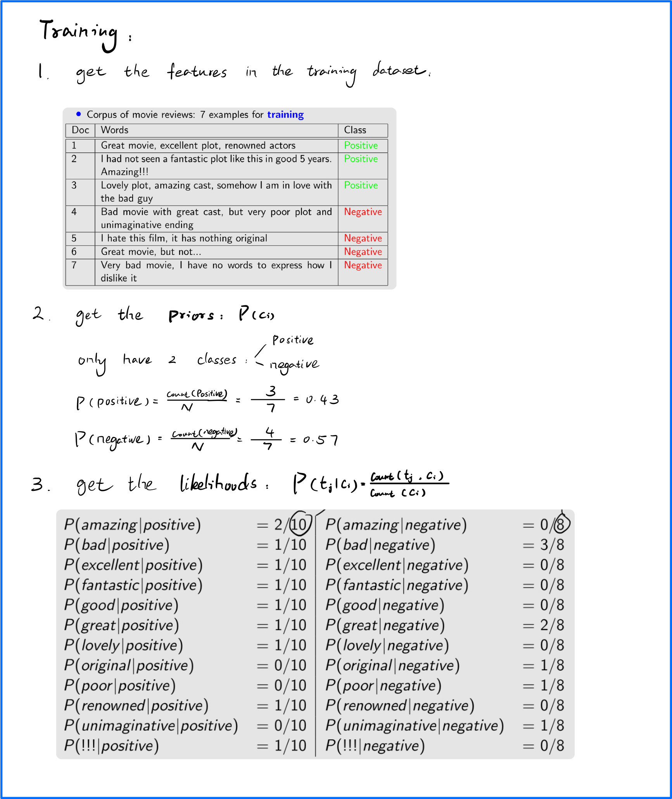
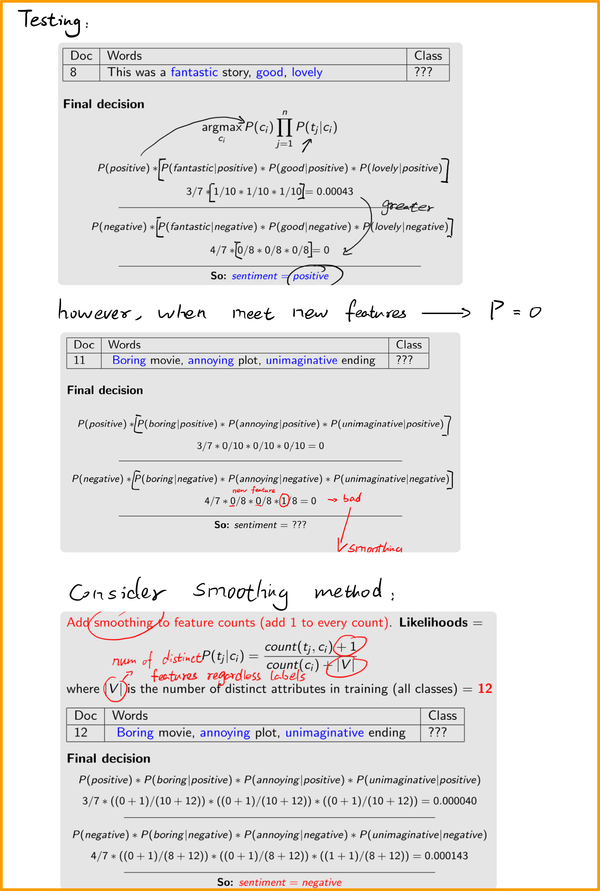

### Critical Summary of Naive Bayes classifier
* Advantages
  - simple and work well for not sparse data
* Disadvantage
  - assumption is almost never true
  - only adjectives can be limiting
  - consider negation

## 6. Evaluation of SA system
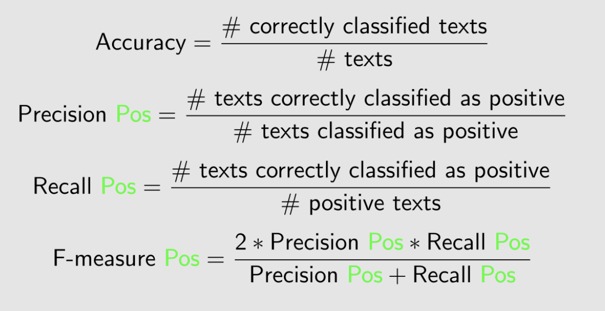

# II. Information Retrieval
## 1. Goal of IR
* [ ] Implement a simple IR system
* [ ] Evaluate how well it does
## 2. Explain & Document indexing
* Given:
  - Document collection
  - Keyword-based query
* Task:
  - Find document relevant to query

### Document Indexing
Represent documents by indexing.
#### Manual Indexing:
1. Need Large and fixed vocabularies
2. Need training

> E.g.
> * Dewey Decimal System
> * ACM
> * MeSH(hierarchy of descriptors)

**Advantages**
* High precision
* Work well for closed collection
  - books-library: Dewey Decimal System

**Disadvantages**
* Need to be an expert
* Labellers need training
* Collection need to be extended

#### Automatic Indexing:
**Basic** inverted files:
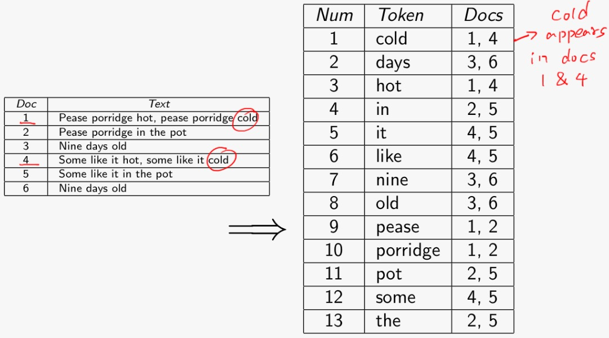
**Frequency** inverted files:
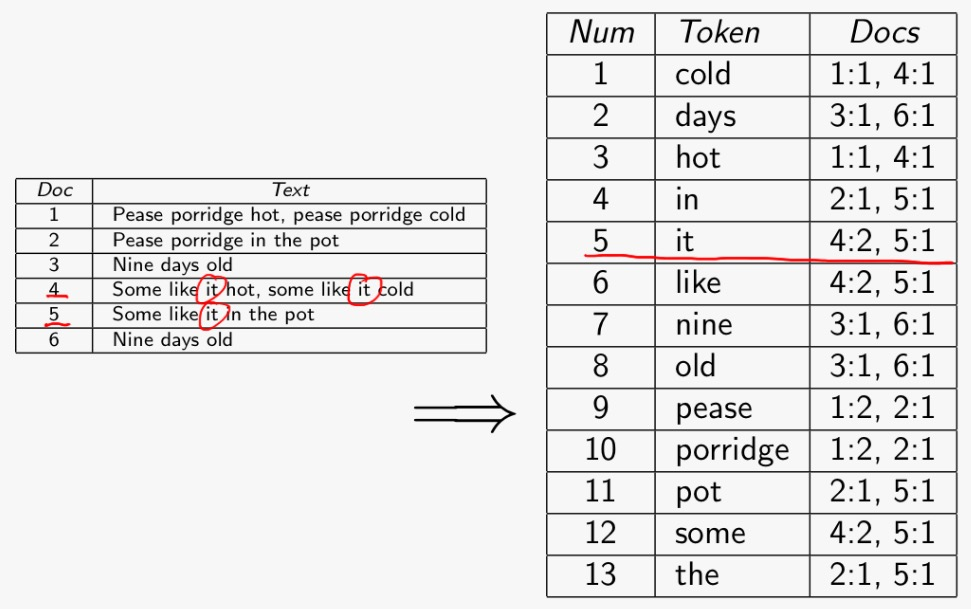
**Position** inverted files:
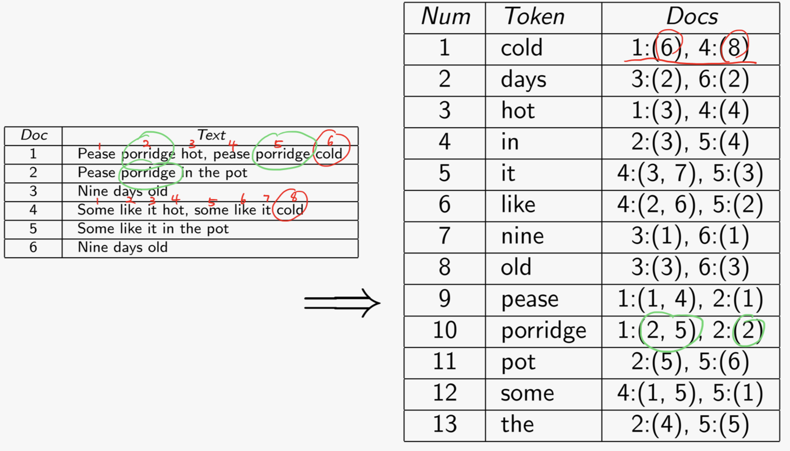

## 3. Retrieval Models (Automated)
### Boolean Search
* Term need to be exist
* Binary decision (relevant)
* Boolean operators (AND, OR)

**Advantages:**
* Very simple model

**Disadvantages:**
* Need expert knowledge
* Not good for users
  - write too many Boolean queries

### Ranked Algorithms (Vector Space Model)
* Use frequency
* "Bags of words"
* High-dimensional Space
  - Each term is a dimension
  - Queries are vectors
* Rank relevance

Each $i$ documents: $\vec{d^i} = (d^i_1,d^i_2,\dots,d^i_n)$

Query: $\vec{q} = (q_1,q_2,\dots,q_n)$

**Basic Term (Euclidean Distance):**

Similarity: $\sqrt{\sum_{k=1}^n(q_k-d_k)^2}$

**Advanced Term (Normalised Cosine):**

Similarity: $sim(\vec{q},\vec{d}) = cos(\vec{q},\vec{d}) = \frac{\vec{q}\cdot\vec{d}}{|\vec{q}||\vec{d}|} = \frac{\sum_{i=1}^nq_id_i}{\sqrt{\sum_{i=1}^nq_i^2}\sqrt{\sum_{i=1}^n}d_i^2}$
> Divide its length $|\vec{x}| = \sqrt{\sum_{i=1}^nx_i^2}$

In this situation, the *cosine* could be
* **1**, same direction
* **0**, orthogonal
* **-1**, opposite
## 3. Manipulation
**Steamming:** chopping their affix

**Stopwords:** exclude "non-content" words

**Term Weighting:**
* Binary: only concern whether term occurs, however, documents with multiple occurences may be more relevant.
* Collection Frequency: frequent in collection may be wrong.
> 
> $|D|=10000$，其中在collection的频率2者差不多，但是包含2者的documents，insurance更为集中。

* Document Frequency: $\frac{|D|}{df_w}$
> This is because $\text{Imformativeness} \propto \frac{1}{\text{Frequency}}$
>
> In above example,
> $$df(\text{insurance}) = \frac{10000}{3997}=2.5 > df(\text{try}) = \frac{10000}{8760}=1.14$$
> However, for too small frequency, $df(\text{mischief}) = \frac{10000}{350}=28.6$
* Inverse Document Frequency (idf): $idf_{w,D} = \log{\frac{|D|}{df_w}}$
> $\log\frac{10000}{3997} = 0.398$ (insurance), $\log\frac{10000}{8760} = 0.057$ (try), $\log\frac{10000}{350} = 1.456$ (mischief)
* Together tf.idf Form: $tf.idf_{w,d,D} = tf_{w,d}\cdot idf_{w,D}$
> $tf_{w,d} = \text{freq}_{w,d}$
>
> $idf_{w,D} = \log\frac{|D|}{df_w}$
>
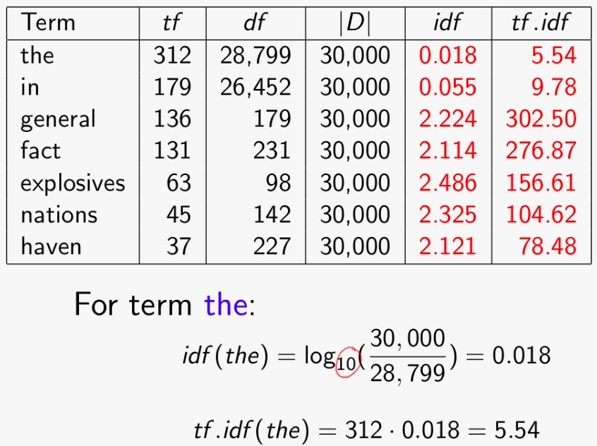

**Example of Vector Space Model using tf.idf:**
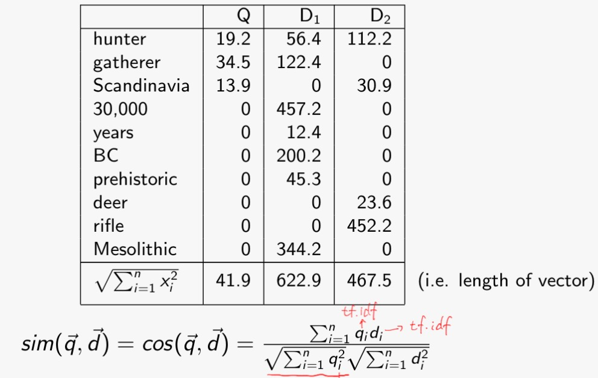

## 4. Web Search Ranking
Need to consider:
* Textual content
* HTML title & headings
* Link text
* Link structure of web (authority)
* **PageRank**
  - authority on outside link
  - authority depends on the number of links
  - recursively
## 5. Evaluation
Use pre-created benchmarking corpus (gold-standard dataset)

Recall: $\frac{A}{A+C}$&nbsp;&nbsp;
Precision: $\frac{A}{A+B}$&nbsp;&nbsp;
F-measure ($\text{F}_1$): $\frac{2PR}{P+R}$

> Precision at a cutoff & Average Precision
>
> 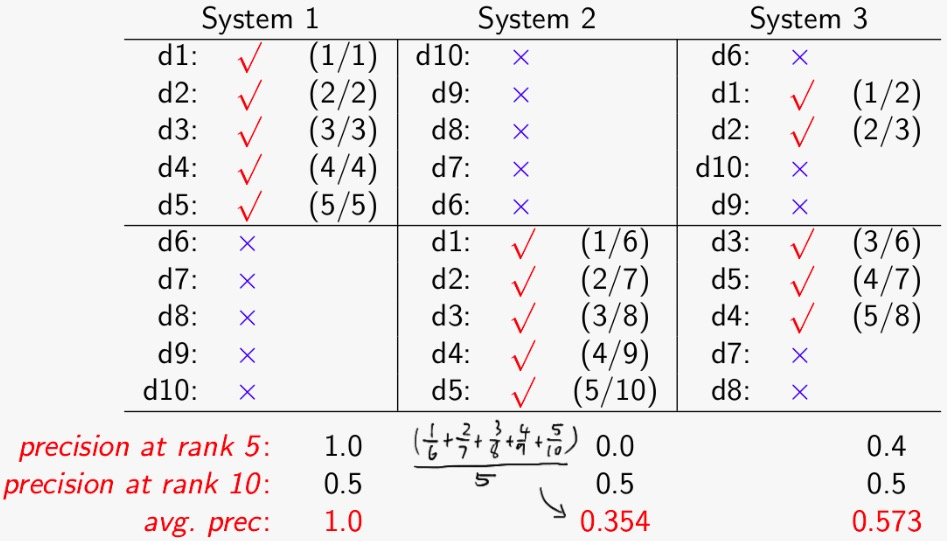

**Examples:**

High precision, low recall:

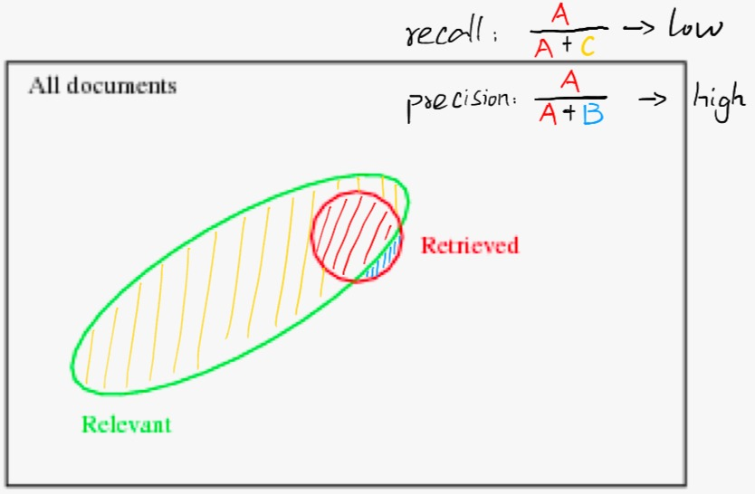

Low precision, high recal:
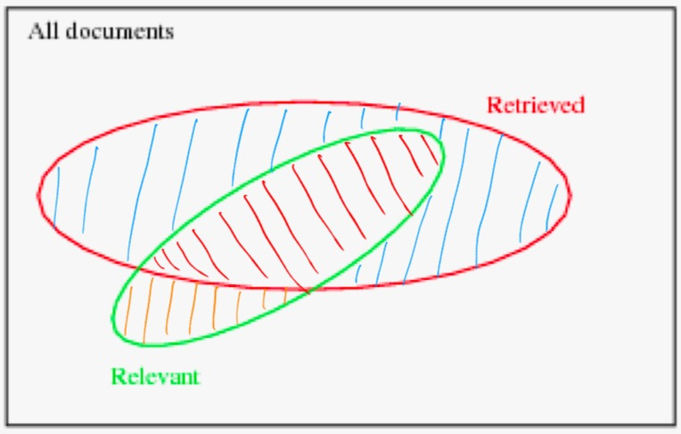

There is always a trade-off between precision and recall.
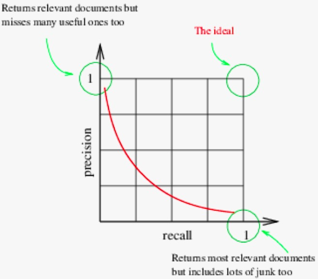

F-measure example:

# III. Natural Language Generation
# IV. Information Extraction
