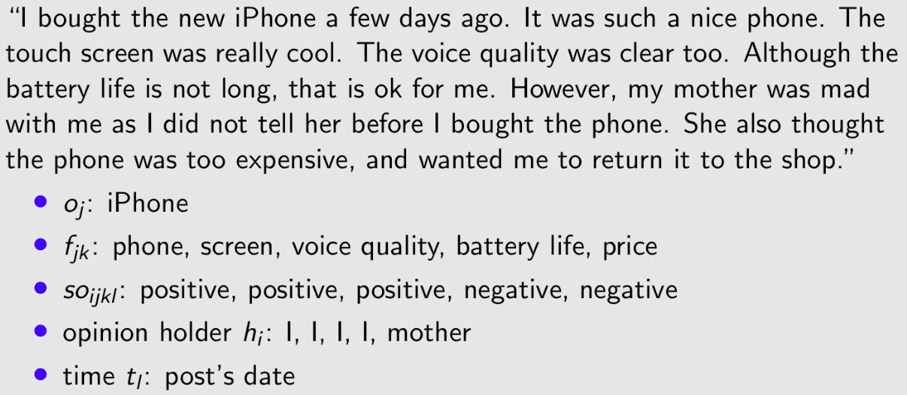

[[toc]]
# I. Sentiment Analysis
## 1. Goal of SA
* [ ] Explain
* [ ] Determine objective & subjective texts
* [ ] Main elements
* [ ] Critical summary of the main approaches
* [ ] Explain the evaluation of SA system

## 2. Explain & Applications
**Definition of SA:**
1. Extract opinions, sentiment and emotions from text and use the information for business.
2. Huge volumes of text and can't be done manually.

**Examples:**
* Product review mining: features of iphone customers like & dislike.
* Review classification: movie positive & negative.
* Tracking sentiments toward topics over time: anger growing or cooling?
* Prediction trends: Election & market

## 3. Objective & Subjective
**Objective** refers to the facts:
* "I bought the new iPhone a few days ago."

**Subjective** may contain opinions of objects (positive or negative):
* "It was such a nice phone."

> 1. Objective can express opinions (indirectly):
>     * Sarcasm: "My phone broke in the second day.""
> 2. Subjective may not express positive or negative opinions:
>     * "I think he came yesterday."

## 4. Model Elements
* Target object: $o_j$
  - has components, sub-components
    - Phone -> Battery | Screen
  - has a set of attributes:
    - Phone{size, price} -> Battery{weight, battery life}"
* Feature of the object $o_j$ : $f_{jk}$
  - opinion on components or attributes
* The sentiment value: $so_{ijkl}$
  - positive or negative
  - rating, 1~5 stars in movie reviews
* Opinion holder: $h_i$
* Time: $t_l$

**Examples:**

> Challenges:
> * Co-reference Resolution: 上下文指代同一物品
> * Relation Extraction: 物品之间的关系，相机拍照片
> * Synonym Match: 同义词

## 4. Approaches of SA
The approaches can be brefly devided into 2 part:
1. Lexicon-based
   * Binary
   * Gradable
2. Corpus-based

### Rule-based Binary Sentiment Classifier

Document-level: Determine the facts and objective sentences.
1. Rule-based subjectivity classifier:
   - more than 2 words come from emotion words lexicon
2. Rule-based sentiment classifier:
   - count positive and negative words

Feature-level:
1. Work on the sentence $s$ containing $f$
2. Select emotion words in $s$: $w_1$, $\dots$, $w_n$
3. Assign orientations for the emotion words $w_i$:
   - 1 = positive
   - -1 = negative
   - 0 = neutral
4. Sum up and assign to $(f , s)$

>  Some words are independent, while others may be **context-dependent**
> * Independent: "great" = positive
> * Dependent:
>   * "small screen" = negative
>   * "not bad" = positive

### Rule-based Gradable Sentiment Classifier

Ranges of sentiment take place binary system:
> For example:
>
> absolutely > utterly > completely > totally > nearly > virtually > essentially > mainly > almost
1. Use pre-assigned emotional weights
> 
2. Additional general rules

|        Rules        |             Situation             |                    Action                     |                     Example                      |
| :-----------------: | :-------------------------------: | :-------------------------------------------: | :----------------------------------------------: |
|    Negation rule    |       "not" in near 5 words       |              decrease 1; invert               |           "good" = +3;"not good" = -2            |
| Capitalization rule |           Capital words           |           positive +1; negative -1            |                   "GOOD" = +4                    |
|  Intensifier rule   | Words in the list of intensifiers |      Weight(very)=1; Weight(extremely)=2      | "very good" = +4; "extremely boring" = -3-2 = -5 |
|   Diminisher rule   |  Words in the list of diminisher  | “somewhat”, “barely”, etc. Decrease the mode. |   "Somewhat good" = +2; "slightly boring" = -2   |
|  Exclamation rule   |         like intensifiers         |                 Weight(!!!)=2                 |                 "great !!!" = 5                  |
|    Emoticon rule    |                                   |        Emotion() = +2; Emotion() = −2         |                                                  |

3. Decision based on ALL emotion words

### Obtain Lexica
Task:
1. Collect emotion words
2. Determine the emotion

Done by:
1. Manually: pre-assigned emotional weights
2. Semi-automatically: find *synonyms/antonyms* of seed emotion words
   * Dictionary-based
   * Corpus-based:
> "beautiful and" (+)
>
> "stupid and" (-)
### Critical Summary of Lexicon-based Approaches
* Advantages:
  - Works effectively with different texts
  - Language independent (up-to-date lexicon)
  - No data training
  - extendable with new lexica (social media)
* Disadvantage:
  - Requires a lexicon of emotion words
  - Compatible with typos

### Corpus-based Supervised Learning
Build Corpus:
> E.g.: "If you are reading this because it is your darling fragrance, please wear it at home exclusively and tape the windows shut." → {negative}

1. Subjectivity Classifier
   - filter out objective sentences
   - Remove HTML or other tags
   - Remove stopwords
2. Sentiment classifier with remaining segments
   - make emotion predictions, e.g. Naive Bayes

# II. Information Retrieval
# III. Natural Language Generation
# IV. Information Extraction
