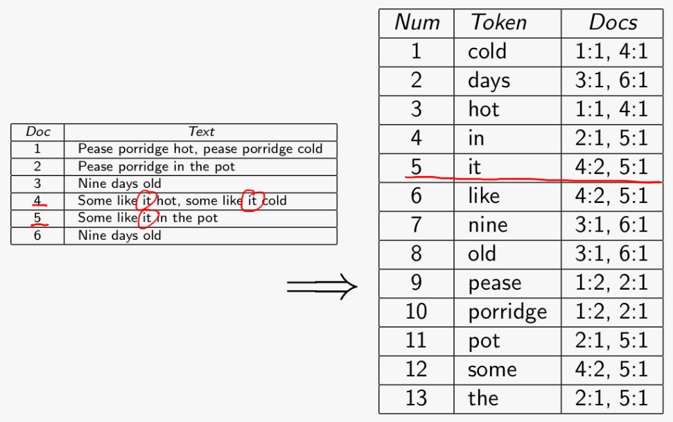
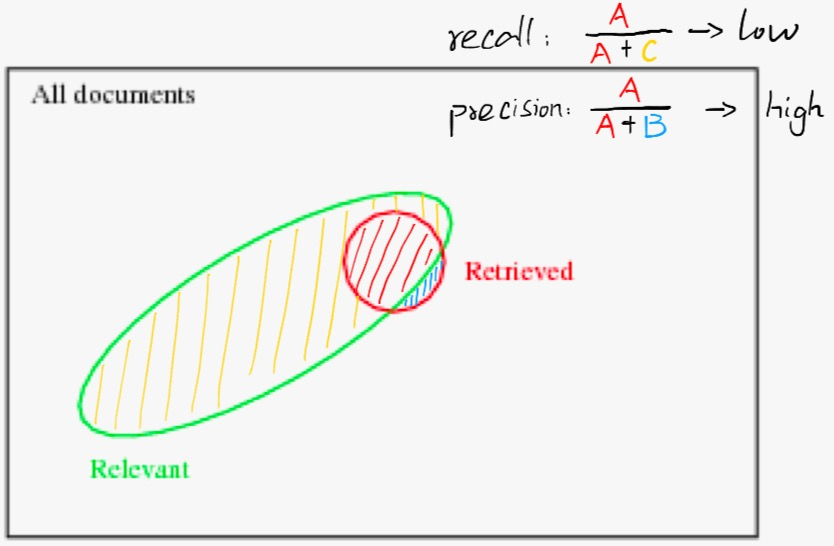
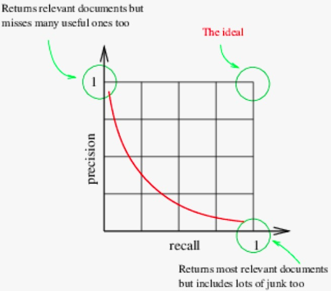

[[toc]]
## 1. Goal of IR
* [ ] Implement a simple IR system
* [ ] Evaluate how well it does
## 2. Explain & Document indexing
* Given:
  - Document collection
  - Keyword-based query
* Task:
  - Find document relevant to query

### Document Indexing
Represent documents by indexing.
#### Manual Indexing:
1. Need Large and fixed vocabularies
2. Need training

> E.g.
> * Dewey Decimal System
> * ACM
> * MeSH(hierarchy of descriptors)

**Advantages**
* High precision
* Work well for closed collection
  - books-library: Dewey Decimal System

**Disadvantages**
* Need to be an expert
* Labellers need training
* Collection need to be extended

#### Automatic Indexing:
**Basic** inverted files:

**Frequency** inverted files:

**Position** inverted files:

## 3. Retrieval Models (Automated)
### Boolean Search
* Term need to be exist
* Binary decision (relevant)
* Boolean operators (AND, OR)

**Advantages:**
* Very simple model

**Disadvantages:**
* Need expert knowledge
* Not good for users
  - write too many Boolean queries

### Ranked Algorithms (Vector Space Model)
* Use frequency
* "Bags of words"
* High-dimensional Space
  - Each term is a dimension
  - Queries are vectors
* Rank relevance

Each $i$ documents: $\vec{d^i} = (d^i_1,d^i_2,\dots,d^i_n)$

Query: $\vec{q} = (q_1,q_2,\dots,q_n)$

**Basic Term (Euclidean Distance):**

Similarity: $\sqrt{\sum_{k=1}^n(q_k-d_k)^2}$

**Advanced Term (Normalised Cosine):**

Similarity: $sim(\vec{q},\vec{d}) = cos(\vec{q},\vec{d}) = \frac{\vec{q}\cdot\vec{d}}{|\vec{q}||\vec{d}|} = \frac{\sum_{i=1}^nq_id_i}{\sqrt{\sum_{i=1}^nq_i^2}\sqrt{\sum_{i=1}^n}d_i^2}$
> Divide its length $|\vec{x}| = \sqrt{\sum_{i=1}^nx_i^2}$

In this situation, the *cosine* could be
* **1**, same direction
* **0**, orthogonal
* **-1**, opposite
## 3. Manipulation
**Steamming:** chopping their affix

**Stopwords:** exclude "non-content" words

**Term Weighting:**
* Binary: only concern whether term occurs, however, documents with multiple occurences may be more relevant.
* Collection Frequency: frequent in collection may be wrong.
> 
> $|D|=10000$，其中在collection的频率2者差不多，但是包含2者的documents，insurance更为集中。

* Document Frequency: $\frac{|D|}{df_w}$
> This is because $\text{Imformativeness} \propto \frac{1}{\text{Frequency}}$
>
> In above example,
> $$df(\text{insurance}) = \frac{10000}{3997}=2.5 > df(\text{try}) = \frac{10000}{8760}=1.14$$
> However, for too small frequency, $df(\text{mischief}) = \frac{10000}{350}=28.6$
* Inverse Document Frequency (idf): $idf_{w,D} = \log{\frac{|D|}{df_w}}$
> $\log\frac{10000}{3997} = 0.398$ (insurance), $\log\frac{10000}{8760} = 0.057$ (try), $\log\frac{10000}{350} = 1.456$ (mischief)
* Together tf.idf Form: $tf.idf_{w,d,D} = tf_{w,d}\cdot idf_{w,D}$
> $tf_{w,d} = \text{freq}_{w,d}$
>
> $idf_{w,D} = \log\frac{|D|}{df_w}$
>

**Example of Vector Space Model using tf.idf:**

## 4. Web Search Ranking
Need to consider:
* Textual content
* HTML title & headings
* Link text
* Link structure of web (authority)
* **PageRank**
  - authority on outside link
  - authority depends on the number of links
  - recursively
## 5. Evaluation
Use pre-created benchmarking corpus (gold-standard dataset)

Recall: $\frac{A}{A+C}$&nbsp;&nbsp;
Precision: $\frac{A}{A+B}$&nbsp;&nbsp;
F-measure ($\text{F}_1$): $\frac{2PR}{P+R}$

> Precision at a cutoff & Average Precision
>
> 

**Examples:**

High precision, low recall:

Low precision, high recal:

There is always a trade-off between precision and recall.

F-measure example:

