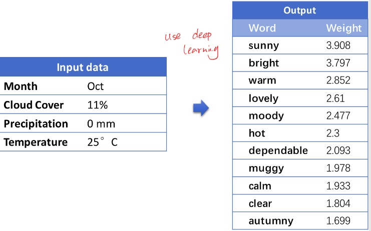

[[toc]]
## 1. Definition & Strategy
**Definition of NLG:**

from non-linguistic to text (or speech)

For example:

* Input: image pixels
* Output: description

* Input: raw data
* Output: text of weather prediction

**Strategy:**

The NLG system mainly contain three stages:

1. Document planning
   - content selection
     - what's important
     > Detail & mention while diving
     - how to write good narrative
     > Positive feedback
   - structure
     - order
     > mention the danger first
     - link words
     > Also, but, because
2. Microplanning
    - Lexical/syntactic
    > risky vs. danger
    - Aggregation
    > "Your first ascent was fine. Your second ascent was fine" vs. "Your first and second ascents were fine.""
    - Refeerence
    > John vs. he
3. Realisation (lowest)(grammar)
    - grammar
    > formal vs. informal
    - structure
    > HTML? RTF?
    - linguistic processing
    > Capitalize the words (it's vs. It's)
## 2. Stage 1: Document planning
Decide use what content and what structure.
### Decide on content
Communicate people with the **correct content** is very **important**.
> E.g. notify dive detail & mention while diving

Three approaches of choose content:
1. Theoretical approach (deep understanding)
   - in-depth knowledge (good kownledge of task, domain and user)
   - need AI engine
   * Disadvantage:
     * Lack of the knowledge of user & content
     * Hard to maintain the knowledge dataset

> **For example:**
>
> Baby Monitoring System:
>   * understand sensor data (what's FiO2)
>   * what's important to different users (doctors, nurses, parents)

2. **Pragmatic approach** (write template to imitate)
   - via the corpus, manually infer the content & structure rules
   - based on imitating patterns (get feedback from experts & users)

3. Statistical approach (train model based on pre-labeled trainning dataset)
   - need **large corpus** to the task

### Decide on rhetorical structure
1. order
2. link words (Rhetorical Relations link the part of text)
    * concession (although, despite)
    * contrast (but, however)
    * elaboration (usually no cue)
    * example (for example, for instance)
    * reason (because, since)
    * sequence (and, also)

> For example: (Tree Structure)
> 

## 4. Stage 2: Microplanning
Choose the appropriate language to express the content.

Problem: express content in many ways, which one should be use.

Approaches:
1. Theoretical (hard to do)
   - define "best" choice
2. Pragmatic (corpus may not be good)
   - imitate corpus (may use statistical learning)

### Lexical/syntactic
Which **words** to use?
> risky vs. danger

**Aspects may affect lexical choice:**
* Frequency (affects readability)
  > lie vs. prevarication
* Formality:
  > Error vs. howler
* Focus, expectations
  > not many, few, a few, only a few [students failed the exam]
* Technical terms
  > standard <u>error</u> vs. standard <u>mistake</u>
* Convention
  > Temperature <u>falls</u> vs. Wind speed <u>eases</u>

**Example of forecast text:**

Task:

System need to know what expressions are suitable. Thus, need to detect the relationship between data and words.

**Represent data in Vector**

Use key-points to get the weight vector of data:

The weight vector of $\text{ws}=9$ is $[0.1,0.9,0,0]$.
$$
\{\text{ws} = 9, \text{dir}=2\} = [0.1,0.9,0,0,0.97,0.03,0,0,0]
$$

Next use deep learning approach to minimize between $v_i$ and $v_d$.

### Aggregation
How/when **combine** phrases into sentences
> "Your first ascent was fine. Your second ascent was fine" vs. "Your first and second ascents were fine.""

### Refeerence
How to **refer** to objects?
> John vs. he

3 types of reference:
1. Pronoun - it, they, he, ...
2. Name - John
3. Definite NP - the big dog

use order: 1>2>3

## 5. Stage 3: Surface Realisation
Take care of details of language:
### syntactic details
The rule of English grammar
> run vs. runs

### morphological details
How words formed
> dog vs. dogs

E.g. (dog, plural) -> dogs
### presentation details
